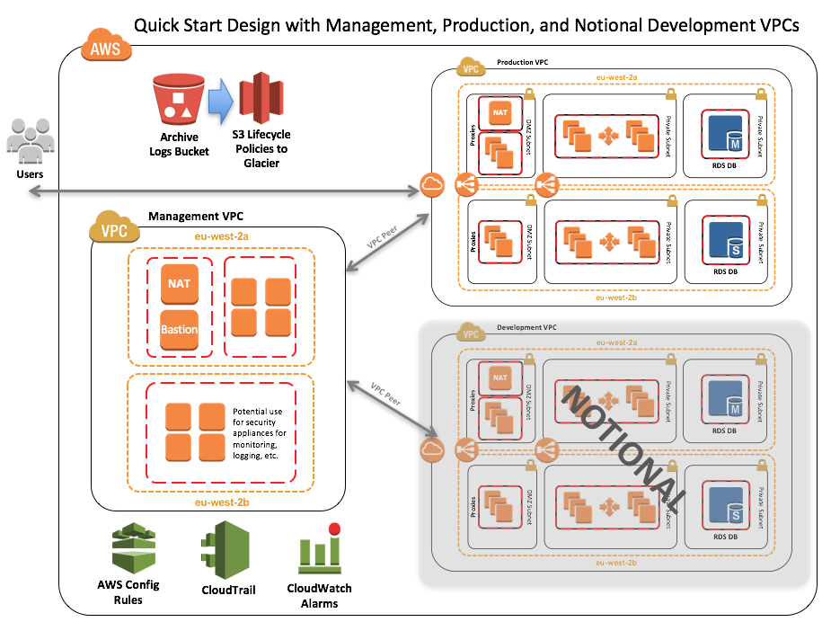

#quickstart-enterprise-accelerator-uk-official

The UK-OFFICIAL Accelerator Quick Start deploys a standardised environment that helps organisations with workloads that fall in scope for UK-OFFICIAL, and follow the NCSC Cloud Security Principles guidance.

The Quick Start will deploy a standard three-tier web architecture using multiple Amazon VPCs (notional development Amazon VPC shown):

You can find more information on the "Standardised Architecture for UK-OFFICIAL on the AWS Cloud: Quick Start Reference Deployment" [web page](https://docs.aws.amazon.com/quickstart/latest/accelerator-uk-official/welcome.html).
