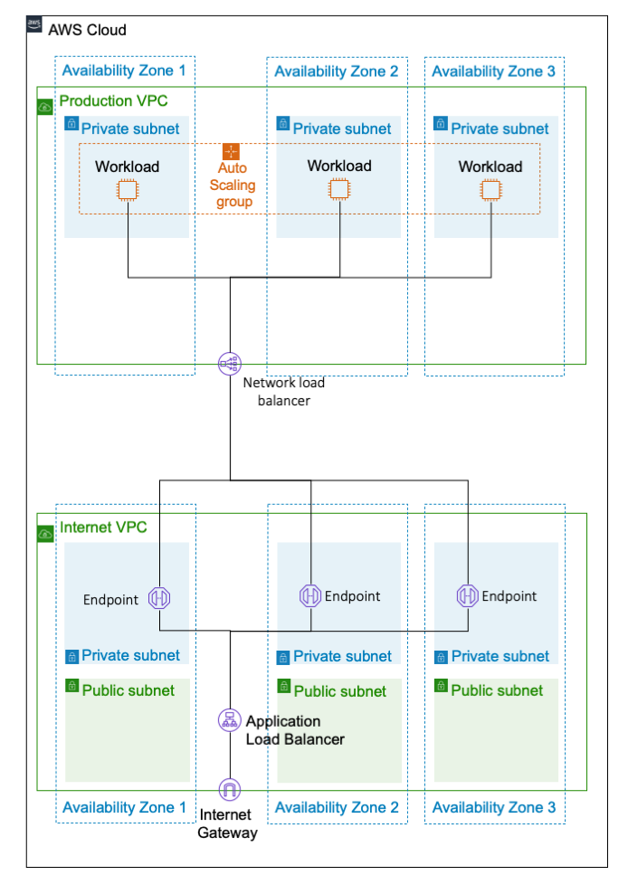

Deploying this Quick Start builds a multi-VPC network topology, a sample LAMP (Linux Apache MySQL PHP) application, and a scalable containerized outbound proxy in the AWS Cloud, as shown in figures 2, 3, and 4.

image::../images/image2.png[image,width=717,height=440]

Figure 2: Amazon Virtual Private Cloud (Amazon VPC) design depicting the integration of a production VPC that hosts application services, an internet VPC that provides both inbound and outbound connectivity, a shared-services VPC that supports common tools (for example, Active Directory), and an endpoint VPC that provides consolidated access to AWS services and outbound access to the internet. The internet VPC can be replaced or enhanced to feature connectivity to a private government network.

Figure 3: Production VPC depicting an integration with an internet VPC for inbound communication to the sample application via AWS PrivateLink

image::../images/image6.png[image,width=762,height=505]

Figure 4: Production VPC depicting outbound access to the internet via the endpoint VPC, which passes requests to an Auto Scaling proxy service

The sample architecture includes the following components and features:

* A basic AWS Identity and Access Management (IAM) configuration with custom IAM policies, associated groups, roles, and instance profiles.
* An external-facing Amazon VPC for controlled internet access with Multi-AZ architecture and separate public and private communication.
* An internal-facing Amazon VPC for shared services (for example, Active Directory) with a Multi-AZ architecture and private subnets to support shared services.
* An internal-facing Amazon VPC for AWS PrivateLink endpoints to allow direct access to AWS services over the AWS backbone with Multi-AZ architecture and private subnets to support shared services.
* An internal-facing Amazon VPC for application workloads with Multi-AZ architecture and private subnets to support shared services.
* AWS Transit Gateway for inter-VPC communication and VPN termination.
* Standard Amazon VPC security groups for Amazon Elastic Compute Cloud (Amazon EC2) instances, load balancers, and endpoints.
* A LAMP application using Auto Scaling and Elastic Load Balancing, which can be modified and/or bootstrapped with customer applications.
* AWS Systems Manager, a sessions manager for administrative access to instances.
* Logging, monitoring, and alerting using AWS CloudTrail, Amazon CloudWatch, and AWS Config rules.
* Amazon Route 53, a resolver to manage the shared private Domain Name System (DNS) for shared services and endpoints across VPCs.
* AWS Certificate Manager (ACM) to store and deploy Secure Sockets Layer (SSL) certificates to endpoints (to enable encryption in transit).
* Capture and analysis of security events and compliance status using AWS GuardDuty.
* Audit compliance across AWS using AWS Security Hub.
